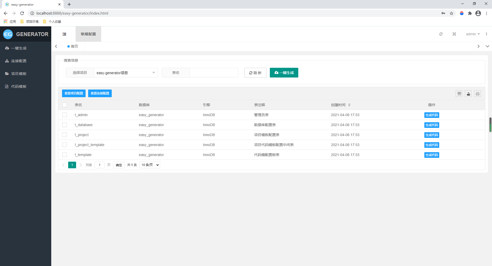
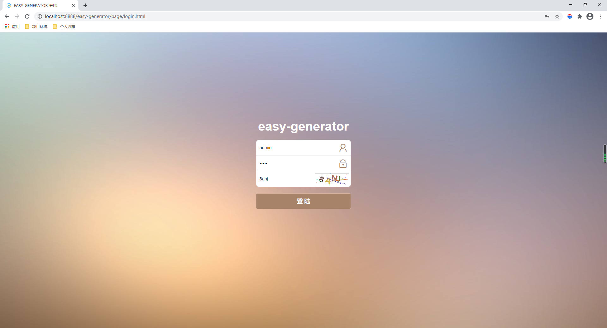
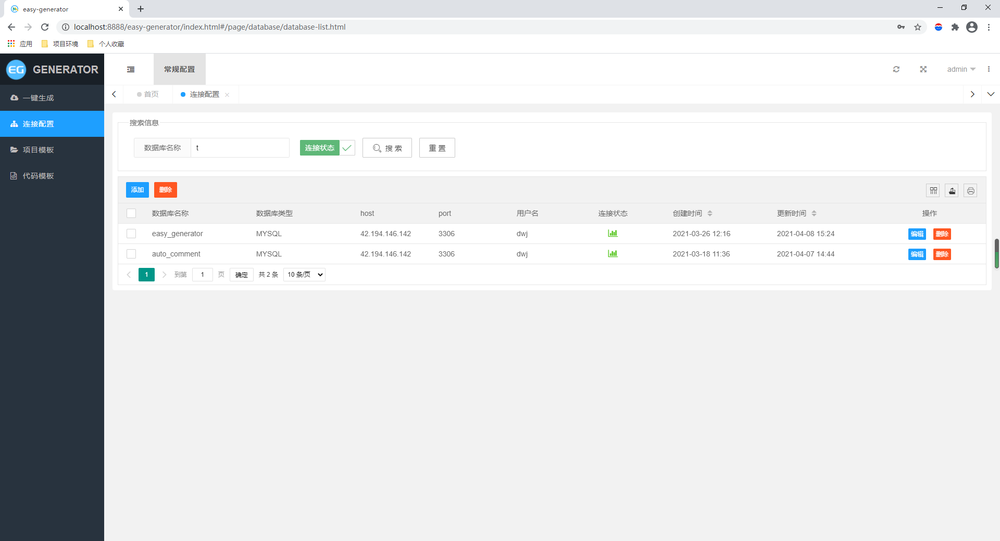
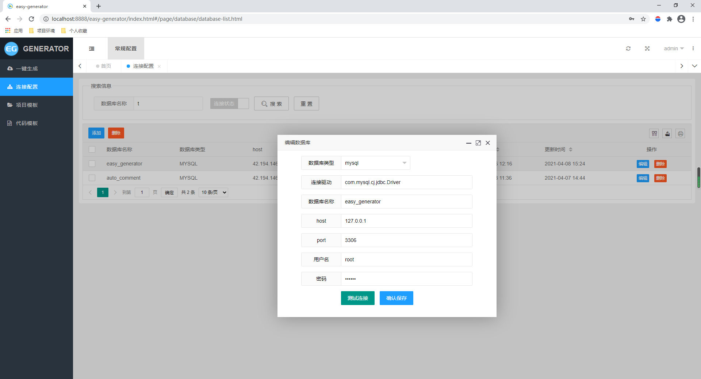
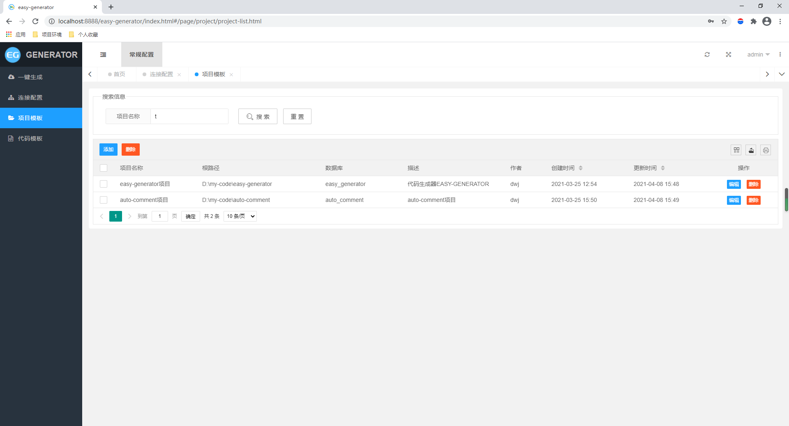
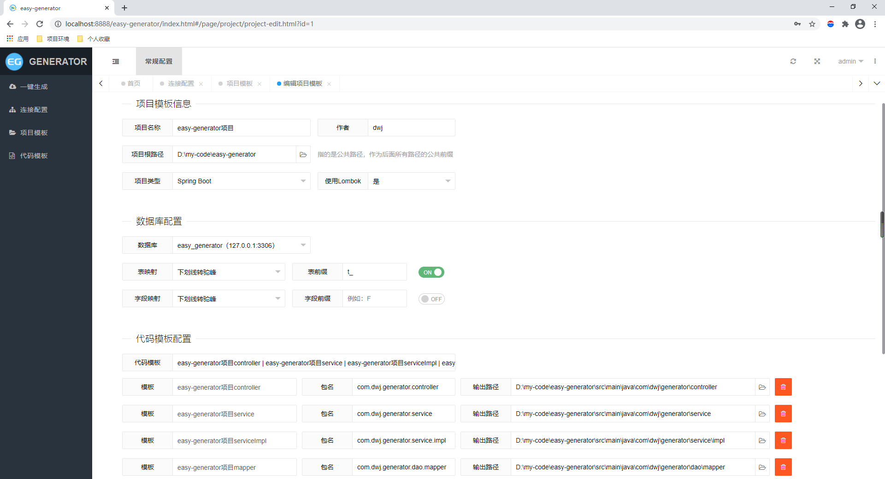
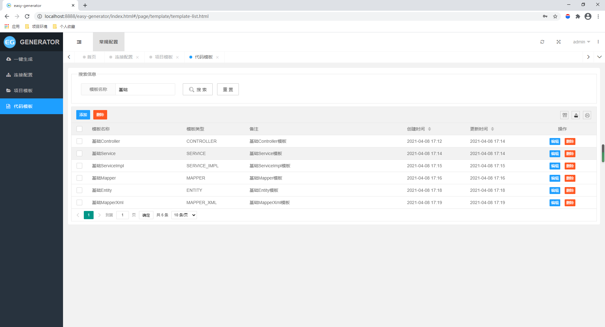
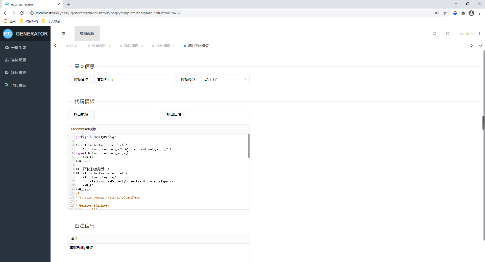

# easy-generator

#### 介绍
一款JAVA代码生成工具，将生成代码的功能集成到了web项目中（Controller、Service、ServiceImpl、Mapper、Entity、XML等），理论上适用所有java项目（全配置化），支持一键生成代码到指定项目包目录，一次配置，节省90%模板代码编写。

#### 源码地址

Github：https://github.com/dangweijian/easy-generator

Gitee：https://gitee.com/dwjian/easy-generator

#### 软件架构
前端：Layuimini iframe版v2

后端：Spring boot、mybatis-plus

设计核心：三大模块

- 连接配置：数据库连接，用于动态读取数据库、表、字段、信息；
- 代码模板：java代码模板配置化，采用Freemarker作为模板引擎，理论上可以编写任何项目代码模板，扩展mybatis-plus组件AutoGenerator，更灵活化；
- 项目配置：即定制自己项目的风格，代码输出位置、包名等，通过关联数据库、关联代码模板、实现配置化；一次配置，永久使用，多人使用（不同开发人员，只要修改项目跟路径即可适配自己本地项目）；

支持数据库：目前仅MySql、后续会陆续扩展；

#### 安装教程

开箱即用：

1. 初始化sql脚本（脚本目录：easy-generator\src\main\resources\sql\easy_generator.sql）；
2. 启动Spring boot；
3. 访问：http://localhost:8888/easy-generator  （默认用户名密码：admin admin，可在t_user表添加）；

#### 使用说明

1. 连接配置：要逆行生成代码的目标数据源；
2. 代码模板：初始化的sql中已提供基础代码模板，可自行修改或新增，使用人员需求熟悉freemarker语法，参考http://freemarker.foofun.cn  文末附上内置通用变量；
3. 项目配置：关联数据库连接，关联相关代码模板，为了生成的代码在编译器中不报错，建议关联齐全（controller、service、serviceImpl、mapper、entity、xml），因为实现类中会依赖接口；例如存在serviceImpl模板、必须要有service模板；这种模板依赖关系，代码中仅做了简单的校验（参考方法com.dwj.generator.config.generator.DwjInjectionConfig#verify），可以跟据自己需求定制；当然，你也可以重写代码模板。

#### 内置通用变量

内置变量指项目中已经封装传递给freemarker模板的变量，可以再编写代码模板时使用。如：${controllerPackage}

| 变量名               | 类型    | 相关配置项                                            | 注释                       |
| -------------------- | ------- | ----------------------------------------------------- | -------------------------- |
| controllerPackage    | string  | 配置的controller包名                                  | controller包名             |
| controllerClassName  | string  | 由代码模板模板前缀后缀，以及表映射策略配置决定        | controller类名             |
| servicePackage       | string  | 配置的service包名                                     | service包名                |
| serviceClassName     | string  | 由代码模板模板前缀后缀，以及表映射策略配置决定        | service类名                |
| serviceImplPackage   | string  | 配置的serviceImpl包名                                 | serviceImpl包名            |
| serviceImplClassName | string  | 由代码模板模板前缀后缀，以及表映射策略配置决定        | serviceImpl类名            |
| mapperPackage        | string  | 配置的mapper包名                                      | mapper包名                 |
| mapperClassName      | string  | 由代码模板模板前缀后缀，以及表映射策略配置决定        | mapper类名                 |
| mapperImplPackage    | string  | 配置的mapperImpl包名                                  | mapperImpl包名             |
| mapperImplClassName  | string  | 由代码模板模板前缀后缀，以及表映射策略配置决定        | mapperImpl类名             |
| entityPackage        | string  | 配置的entity包名                                      | entity包名                 |
| table                | object  | 无                                                    | 数据表相关信息对象         |
| entityLombokModel    | boolean | 项目配置中是否使用Lombok配置                          | 使用Lombok标识             |
| restControllerStyle  | boolean | 项目配置中项目类型Springboot->true，spring mvc->false | 是否rest风格controller标识 |
| 未完待补充...        |         |                                                       |                            |
|                      |         |                                                       |                            |

#### 参与贡献

欢迎参与项目贡献，反馈BUG，优化建议等！

#### 关于作者

QQ：315200140    

公众号留言：

#### 项目演示图

